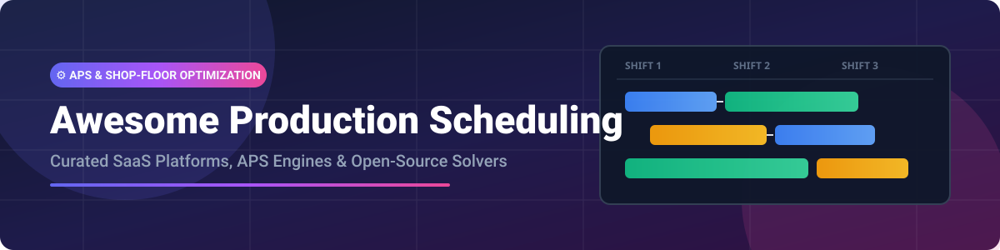

# 🏭 Awesome Production Scheduling Platform 🚀

<p align="center">
  
</p>

<p align="center">
  <a href="https://github.com/ishandutta2007/Awesome-Awesome-Awesome"></a>
  <a href="https://discord.gg/jc4xtF58Ve"></a>
  
  
  <a href="https://github.com/ishandutta2007"></a>
</p>

## 📌 Top Production Scheduling Platforms & Advanced Planning Systems Ecosystem ⚡

**Curated List of Production Scheduling SaaS Platforms, Finite Capacity Scheduling Systems & Open-Source Optimization Engines**

*Focused on Advanced Planning & Scheduling (APS), Finite Capacity Scheduling, Shop-Floor Sequencing, Constraint Programming, Job-Shop Optimization & Manufacturing Operations Management (MOM)*

📅 **Last updated: September 2026**

---

### 💡 Overview & Market Insights

This repository tracks top **SaaS/enterprise platforms** and **open-source projects** for **Production Scheduling** and **Advanced Planning and Scheduling (APS)**. These systems generate feasible, constraint-aware production schedules respecting machine capacity, tooling, material availability, setup times, and labor shifts, directly integrating with Enterprise Resource Planning (ERP) and Manufacturing Execution Systems (MES).

> 📊 **Market Size & Structure**: The global Advanced Planning and Scheduling (APS) software market is estimated at **$2.5 Billion to $3.2 Billion**, growing at a CAGR of ~9.5%. The market is **moderately fragmented**: enterprise giants like Siemens (Opcenter APS) and Dassault Systèmes (DELMIA Ortems/Quintiq) hold dominant positions in automotive and aerospace, while specialized mid-market players (PlanetTogether, Asprova, JustPlanIt) thrive in niche discrete and process manufacturing domains.

---

## 📑 Table of Contents
- [🏢 SaaS & Hosted APS Platforms](#-saas--hosted-aps-platforms)
- [🔓 Open-Source GitHub Projects](#-open-source-github-projects)
- [🛠️ Architecture & Integration Guide](#%EF%B8%8F-architecture--integration-guide)
- [🤝 How to Contribute](#-how-to-contribute)
- [❤️ Support & Sponsoring](#%EF%B8%8F-support--sponsoring)
- [📈 Star History](#-star-history)
- [⚠️ Disclaimer](#%EF%B8%8F-disclaimer)

---

## 🏢 SaaS & Hosted APS Platforms

| Platform | Description | Est. Company Scale (Valuation / Revenue) | Starting Tier / Pricing | Free Tier / Trial Limit |
| :--- | :--- | :--- | :--- | :--- |
| **[Siemens Opcenter APS](https://www.siemens.com/)** | Enterprise APS solution (evolved from Preactor) for detailed scheduling, finite capacity planning, and shop-floor sequencing. | **~$175B+ Valuation** (Siemens AG) / ~$85B Rev | Starts at ~$20,000/year (Modular enterprise subscription) | No free trial; guided demo available through Siemens sales/partners |
| **[DELMIA Ortems](https://www.3ds.com/)** | Dassault Systèmes APS solution for production planning and scheduling within the broader DELMIA manufacturing portfolio. | **~$55B+ Valuation** (Dassault Systèmes) / ~$6.5B Rev | Starts at ~$20,000+/year (Enterprise quote-based license) | No free trial; personalized live demo and discovery assessment available |
| **[Quintiq (DELMIA Quintiq)](https://www.3ds.com/)** | Powerful supply chain planning and production optimization platform handling complex multi-site constraints. | **~$55B+ Valuation** (Dassault Systèmes / Acquired for ~$300M) | Starts at ~$7,500/month (Enterprise quote-based solution) | No free trial; interactive demonstration available upon request |
| **[Asprova](https://www.asprova.com/)** | High-speed APS engine widely used in automotive, electronics, and high-mix manufacturing environments. | **~$50M–$100M Est. Valuation** / ~$15M–$30M Rev | Starts at ~JP¥15,000 (~$100/mo) per module / ~$50,000+ annual package | Free trial version available (downloadable, restricted to evaluation data limits) |
| **[PlanetTogether](https://www.planettogether.com/)** | Dedicated APS platform for discrete and process manufacturing with strong ERP integration and what-if scenario planning. | **~$30M–$80M Est. Valuation** / ~$10M–$20M Rev | Starts at ~$20,000/year (Quote-based enterprise licensing) | 3-month "Try Before You Buy" program (with onboarding services) |
| **[Optessa](https://www.optessa.com/)** | Advanced planning and scheduling software using patented optimization algorithms for assembly and complex job shops. | **~$20M–$50M Est. Valuation** / ~$5M–$15M Rev | Quote-based enterprise pricing (scaled by facility & solver complexity) | No free trial; customized live proof-of-concept demo available |
| **[FLEXSCHE](https://www.flexsche.com/)** | Flexible production scheduling software focused on detailed shop-floor sequencing, flexible rules, and Gantt charts. | **~$15M–$40M Est. Valuation** / ~$3M–$10M Rev | Quote-based enterprise licensing (customized by module & shop size) | Free evaluation version available (full functionality with data volume limits) |
| **[JustPlanIt](https://www.justplanit.com/)** | Specialized job-shop scheduling SaaS designed for small-to-midsize custom manufacturers. | **~$5M–$15M Est. Valuation** / ~$1M–$5M Rev | Quote-based subscription + one-time launch program fee | 14-day free trial available |

---

## 🔓 Open-Source GitHub Projects

Curated open-source solvers, production planning systems, job-shop scheduling libraries, and ERP scheduling modules, sorted by GitHub stargazers count:

- **[Google OR-Tools](https://github.com/google/or-tools)** [](https://github.com/google/or-tools/stargazers)  
  Google's fast, open-source software suite for combinatorial optimization, including Constraint Programming (CP-SAT) and Vehicle Routing (VRP) heavily used in job-shop production scheduling.

- **[Odoo](https://github.com/odoo/odoo)** [](https://github.com/odoo/odoo/stargazers)  
  Comprehensive open-source ERP suite featuring integrated Manufacturing (MRP), Work Orders, Workcenter Capacity Planning, and visual Gantt production scheduling.

- **[ERPNext](https://github.com/frappe/erpnext)** [](https://github.com/frappe/erpnext?style=social&color=white)  
  Modern open-source ERP system containing production planning tools, Workstation capacity tracking, Operation Time logs, and BOM management.

- **[Timefold Solver (formerly OptaPlanner)](https://github.com/TimefoldAI/timefold-solver)** [](https://github.com/TimefoldAI/timefold-solver/stargazers)  
  AI constraint satisfaction solver in Java/Python for planning and scheduling problems like job-shop scheduling, shift rostering, and resource allocation.

- **[OptaPlanner (Legacy)](https://github.com/kiegroup/optaplanner)** [](https://github.com/kiegroup/optaplanner/stargazers)  
  KIE Group open-source Java constraint solver engine widely applied to manufacturing optimization and vehicle routing.

- **[frePPLe](https://github.com/frePPLe/frepple)** [](https://github.com/frePPLe/frepple/stargazers)  
  Leading dedicated open-source Advanced Planning and Scheduling (APS) engine. Supports finite capacity scheduling, multi-level BOMs, inventory planning, and REST API ERP integration.

- **[OR-Gym](https://github.com/hubbs5/or-gym)** [](https://github.com/hubbs5/or-gym/stargazers)  
  Reinforcement learning environments for Operations Research problems, including inventory management, knapsack, and job-shop scheduling.

- **[Job Shop Scheduling Benchmark (JSP)](https://github.com/taspinar/job-shop-scheduling-problem)** [](https://github.com/taspinar/job-shop-scheduling-problem/stargazers)  
  Python implementations of exact, heuristic, and metaheuristic algorithms (Genetic Algorithms, Simulated Annealing) for solving classical Job-Shop Scheduling Problems (JSSP).

- **[python-lekin](https://github.com/topic/job-shop-scheduling)** [](https://github.com/taspinar/job-shop-scheduling-problem/stargazers)  
  Academic and open Python libraries focused on flexible job-shop scheduling research, dispatching rules, and sequencing heuristics.

---

### 💡 Additional Open-Source Options & Strategy

1. **Dedicated Open APS**: Use **frePPLe** when you need an out-of-the-box open-source APS with finite capacity engines, web UI, and ERP connectors.
2. **Custom Optimization Engines**: Build tailored solvers using **Google OR-Tools (CP-SAT)** or **Timefold Solver** to model hyper-specific plant constraints (e.g., sequence-dependent setup times, oven baking windows).
3. **ERP-Native Scheduling**: Leverage open ERP modules (**Odoo**, **ERPNext**) for basic MRP, work order scheduling, and inventory tracking without full APS complexity.

---

## 🛠️ Architecture & Integration Guide

```
[ ERP System ] (Orders, BOMs, Inventories)
       │
       ▼
[ APS Engine / Solver ] (frePPLe / OR-Tools / PlanetTogether)
       │ (Generates Finite Capacity Gantt Schedule)
       ▼
[ MES / Shop-Floor ] (Work Orders, Machine Execution, Progress Updates)
```

---

## 🤝 How to Contribute

Contributions are welcome! To add a new platform or tool:
1. Fork this repository 🍴
2. Add the item to `README.md` keeping formatting consistent ✍️
3. Submit a Pull Request with a short summary of the product 🚀

---

## ❤️ Support & Sponsoring

If you find this curated ecosystem list helpful for your production planning or manufacturing engineering projects, please consider:
- ⭐ **Starring** this repository on GitHub!
- 🔀 **Forking** and sharing it with operations leaders and research peers!
- ☕ **Buying a coffee / Sponsoring** the maintainer on [GitHub Sponsors](https://github.com/sponsors/ishandutta2007)!

<a href="https://github.com/sponsors/ishandutta2007"></a>

---

## 📈 Star History

[](https://star-history.dera.page/#ishandutta2007/Awesome-Production-Scheduling-Platform&type=date&legend=top-left)

---

## ⚠️ Disclaimer

- This is a **community-curated** resource list for informational and educational purposes.
- Production scheduling systems directly impact plant operations, lead times, and manufacturing throughput. Always validate solvers and platforms thoroughly with realistic benchmark data before live deployment.
